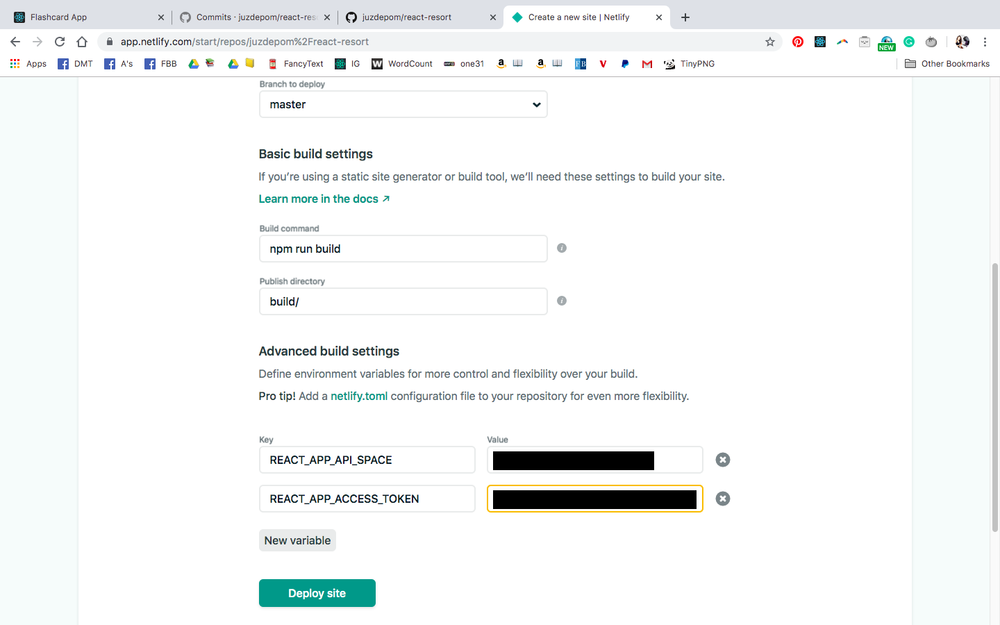

## React Resorts Project

### See Website: https://react-resort-tutorial.netlify.com/


Note: currently website is coded to show the data that is locally stored in the data.js file, however, can go into the context.js file to to switch over to pulling data from Contentful.

<strong>Based off of the ~6 hour</strong> [In-Depth React Tutorial: Build a Hotel Reservation Site (with Contentful and Netlify)
](https://www.youtube.com/watch?v=LXJOvkVYQqA) on FreeCodeCamp by Coding Addict.

Account on Contentful is linked to this Github account.

<strong>Set Up Files</strong>: [https://github.com/john-smilga/setup-files-react-beach-resort](https://github.com/john-smilga/setup-files-react-beach-resort)

Important! When deploying to Netlify don't forget to manually write in the environment variables (see image below)



VSCode Tip: Command + Shift + V to see README preview.


<hr/>


## Dependencies 

* ```npm install react-router-dom```
* ```npm install react-icons```
    * <strong>React Icons Documentation:</strong>https://react-icons.netlify.com/#/ 
* ```npm install styled-components```
    * <strong>Styled Components Documentation: </strong>https://www.styled-components.com/docs
* ```npm install contentful```
    * [Contentful](https://www.contentful.com/)


## Other Resources

* <strong>"React Router Dom" does not play very well with "Netlify" out of the box</strong>, which means  a <em>redirect file</em> is needed.
  * The redirect file is located in the "set up" folder that Coding Addict provides. It's called "_redirects" and will be placed in the public folder.
  * See [Page Not Found on Netlify with React Router](https://sung.codes/blog/2018/12/18/page-not-found-on-netlify-with-react-router/) for a more in-depth explanation.

* <strong>React Context API Documentation: </strong>https://reactjs.org/docs/context.html#reactcreatecontext

* <strong>(Very useful!) Enable Emmet for React.js JSX in VSCode: </strong> https://www.youtube.com/watch?v=8dkGmPprlWM


## Work Log

#### Tu, Dec 10, 2019 - Total Time Spent Coding Out Project: 9h45


#### Commits

* created the .env.development file, added to .gitignore and made Contentful.js available for upload
* linked up with Contentful, created Contentful.js file but gitignored it. An example can be found at ContentfulExample.js
* npm installed contentful
* set up size, breakfast, and pets filter in RoomsFilter
* set up price filter in RoomsFilter
* set up guest number filter in RoomsFilter
* set up room type filter in the RoomFilter component
* built out the RoomsList component
* created RoomsFilter, RoomsList, and RoomsContainer component. Showed two methods of setting up the context api with context.js
* finished setting up SingleRoom component
* [npm installed styled-components and created the StyledHero component for the SingleRoom component](https://github.com/juzdepom/react-resort/commit/cea85b3759898351efab63ab62c32bd9ca44234b)
* [set up Hero and Banner components in the SingleRoom component](https://github.com/juzdepom/react-resort/commit/3c30bf6b5e0be96195f53233d82726a75de66691)
* set up context api with SingleRoom component and accessed method with the slug as a parameter
* set up Loading and Room component and incorporated into FeaturedRooms component
* customized context api for FeaturedRooms component
* set up the context api with the FeaturedRooms component
* set up Services and Title component
* set up Banner component
* set up the Hero component
* stylized navbar component
* created and installed navbar
* set up react-router-dom foundation
* added the setup files and created the home, rooms, singleroom and error page
* installed react-icons, react-router-dom and updated README
* Initial commit from Create React App

<hr/>

## Boilerplate React ReadME

This project was bootstrapped with [Create React App](https://github.com/facebook/create-react-app).

## Available Scripts

In the project directory, you can run:

### `npm start`

Runs the app in the development mode.<br />
Open [http://localhost:3000](http://localhost:3000) to view it in the browser.

The page will reload if you make edits.<br />
You will also see any lint errors in the console.

### `npm test`

Launches the test runner in the interactive watch mode.<br />
See the section about [running tests](https://facebook.github.io/create-react-app/docs/running-tests) for more information.

### `npm run build`

Builds the app for production to the `build` folder.<br />
It correctly bundles React in production mode and optimizes the build for the best performance.

The build is minified and the filenames include the hashes.<br />
Your app is ready to be deployed!

See the section about [deployment](https://facebook.github.io/create-react-app/docs/deployment) for more information.

### `npm run eject`

**Note: this is a one-way operation. Once you `eject`, you can’t go back!**

If you aren’t satisfied with the build tool and configuration choices, you can `eject` at any time. This command will remove the single build dependency from your project.

Instead, it will copy all the configuration files and the transitive dependencies (Webpack, Babel, ESLint, etc) right into your project so you have full control over them. All of the commands except `eject` will still work, but they will point to the copied scripts so you can tweak them. At this point you’re on your own.

You don’t have to ever use `eject`. The curated feature set is suitable for small and middle deployments, and you shouldn’t feel obligated to use this feature. However we understand that this tool wouldn’t be useful if you couldn’t customize it when you are ready for it.

## Learn More

You can learn more in the [Create React App documentation](https://facebook.github.io/create-react-app/docs/getting-started).

To learn React, check out the [React documentation](https://reactjs.org/).

### Code Splitting

This section has moved here: https://facebook.github.io/create-react-app/docs/code-splitting

### Analyzing the Bundle Size

This section has moved here: https://facebook.github.io/create-react-app/docs/analyzing-the-bundle-size

### Making a Progressive Web App

This section has moved here: https://facebook.github.io/create-react-app/docs/making-a-progressive-web-app

### Advanced Configuration

This section has moved here: https://facebook.github.io/create-react-app/docs/advanced-configuration

### Deployment

This section has moved here: https://facebook.github.io/create-react-app/docs/deployment

### `npm run build` fails to minify

This section has moved here: https://facebook.github.io/create-react-app/docs/troubleshooting#npm-run-build-fails-to-minify
